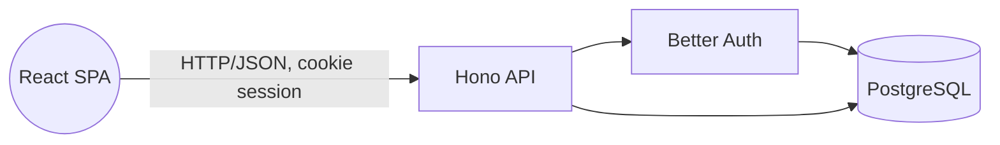
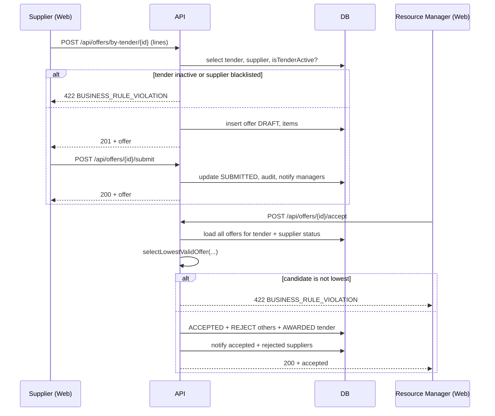

# Architecture

## Style

**Modular monolith.** Two deployable artifacts (an HTTP API and a static SPA) plus a shared
TypeScript package. The API is *internally* divided into business modules, but it ships as
a single process. This is deliberate — the project does not justify the complexity of
distributed services, and the modular separation gives us most of the benefits at a fraction
of the operational cost.

## Components

## Layers inside the API

| Layer | Purpose |
| --- | --- |
| `auth/` | Better Auth instance with Drizzle adapter, OAuth providers, session config |
| `config/` | Typed env loader |
| `db/` | Drizzle schema + client, migrations, seed |
| `middleware/` | Session hydration, `requireAuth`, `requireRole`, `requirePermission`, central error handler |
| `modules/<feature>/<feature>.routes.ts` | HTTP routes for the feature |
| `modules/<feature>/<feature>.service.ts` | Pure business logic — state transitions, selection algorithms (heavily unit-tested) |
| `shared/` | `errors`, `validate` (Valibot wrapper), `audit`, `notify` cross-cutting helpers |

## Cross-cutting patterns

- **Permission matrix as data.** `packages/shared/src/permissions/index.ts` is the single
  source of truth, consumed by both API middleware and Web route guards. There are no ad-hoc
  `if (user.role === ...)` branches in business code.
- **Validation.** Valibot schemas in `@frms/shared/schemas` are imported by the API routes
  (server-side, mandatory) and by the React forms (UX). The same schema → identical rules.
- **State machines.** `needs.service`, `tenders.service`, `offers.service` each export a
  validator that is the only place where transitions are accepted/rejected. Tests pin every
  transition.
- **Audit + notifications.** Side-effects after state changes are funneled through
  `shared/audit.ts` and `shared/notify.ts`. Failures here log but do not throw — audit/notify
  must never break a business operation.

## Frontend architecture

- **File-based routing** (TanStack Router + Vite plugin). Every route file exports `Route`;
  `routeTree.gen.ts` is regenerated on save.
- **Server state** lives in TanStack Query; **form state** lives in TanStack Form / local
  `useState`; **auth state** is provided by `AuthProvider` and injected into the router context.
- **Authentication guard**: pathless layout `_authenticated.tsx` runs `beforeLoad` on every
  child route. If unauthenticated, it throws `redirect({ to: "/login", search: { redirect } })`.
- **Per-page guards**: each role-specific route declares the allowed roles in `beforeLoad` and
  redirects to `/dashboard` if the user does not match. This is defense-in-depth — the API
  also enforces the permission.
- **API client**: `lib/api-client.ts` always sends `credentials: "include"` so the
  Better Auth cookie is forwarded in the cross-origin dev setup.

## Sequence — submit and select an offer

