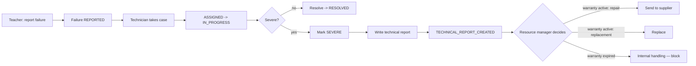
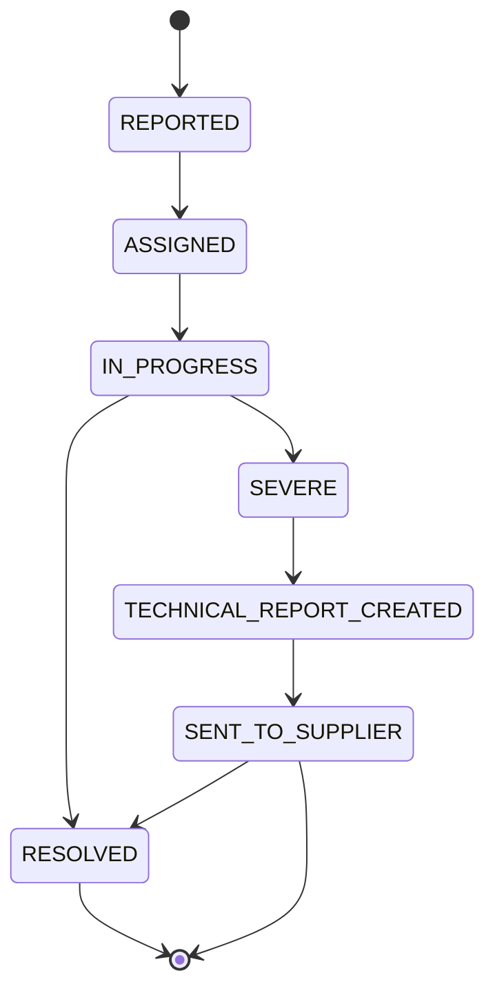

# BPMN — Maintenance process

## Failure state machine

## Business rules

- A teacher can only report failures on resources actively assigned to them or to their
  department.
- Printer failures must always have type `HARDWARE`.
- A technical report is required to escalate to the warranty path.
- The resource manager can request supplier repair or replacement only if the warranty end
  date has not passed.
