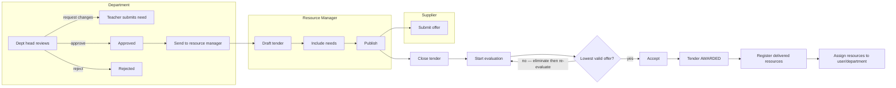
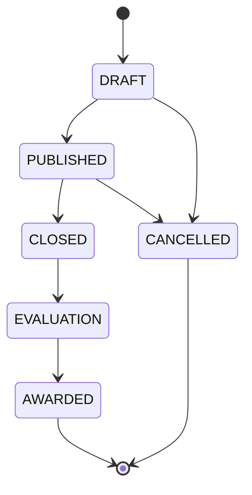
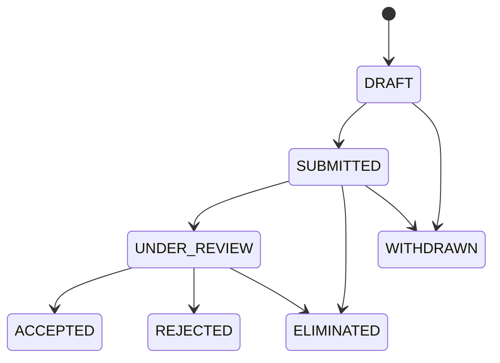
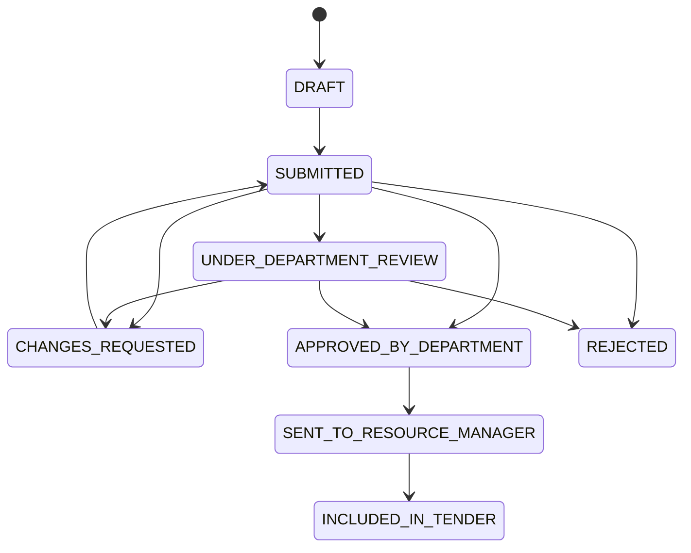

# BPMN — Tender process

```mermaid
flowchart LR
  subgraph Department
    T[Teacher submits need]
    H[Dept head reviews]
    H -->|approve| HA[Approved]
    H -->|request changes| T
    H -->|reject| HX[Rejected]
    HA --> HS[Send to resource manager]
  end

  subgraph Resource Manager
    HS --> MD[Draft tender]
    MD --> MI[Include needs]
    MI --> MP[Publish]
  end

  subgraph Supplier
    MP --> SS[Submit offer]
  end

  MP --> MC[Close tender]
  MC --> ME[Start evaluation]
  ME --> MB{Lowest valid offer?}
  MB -->|yes| MA[Accept]
  MB -->|no — eliminate then re-evaluate| ME
  MA --> AW[Tender AWARDED]
  AW --> RD[Register delivered resources]
  RD --> AS[Assign resources to user/department]
```

## State machine — Tender

```mermaid
stateDiagram-v2
  [*] --> DRAFT
  DRAFT --> PUBLISHED
  DRAFT --> CANCELLED
  PUBLISHED --> CLOSED
  PUBLISHED --> CANCELLED
  CLOSED --> EVALUATION
  EVALUATION --> AWARDED
  AWARDED --> [*]
  CANCELLED --> [*]
```

## State machine — Offer

```mermaid
stateDiagram-v2
  [*] --> DRAFT
  DRAFT --> SUBMITTED
  DRAFT --> WITHDRAWN
  SUBMITTED --> UNDER_REVIEW
  SUBMITTED --> ELIMINATED
  SUBMITTED --> WITHDRAWN
  UNDER_REVIEW --> ACCEPTED
  UNDER_REVIEW --> REJECTED
  UNDER_REVIEW --> ELIMINATED
```

## State machine — Need

```mermaid
stateDiagram-v2
  [*] --> DRAFT
  DRAFT --> SUBMITTED
  SUBMITTED --> UNDER_DEPARTMENT_REVIEW
  SUBMITTED --> CHANGES_REQUESTED
  SUBMITTED --> APPROVED_BY_DEPARTMENT
  SUBMITTED --> REJECTED
  UNDER_DEPARTMENT_REVIEW --> CHANGES_REQUESTED
  UNDER_DEPARTMENT_REVIEW --> APPROVED_BY_DEPARTMENT
  UNDER_DEPARTMENT_REVIEW --> REJECTED
  CHANGES_REQUESTED --> SUBMITTED
  APPROVED_BY_DEPARTMENT --> SENT_TO_RESOURCE_MANAGER
  SENT_TO_RESOURCE_MANAGER --> INCLUDED_IN_TENDER
```
