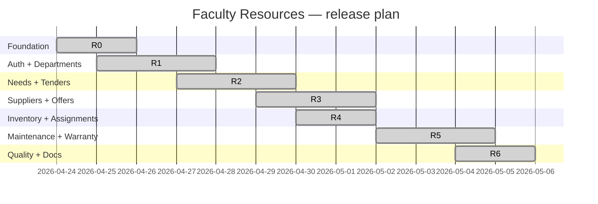

# Release plan

| Release | Scope | Status |
| --- | --- | --- |
| **R0** Foundation | Bun workspace, shared package, base configs, Docker compose, env, CI baseline | Done |
| **R1** Auth + RBAC + Departments | Better Auth (email/pw, GitHub, Google), permission matrix, users, departments, role-aware shell | Done |
| **R2** Needs + Tenders | Teacher needs, department head review/finalize, resource manager tenders, publish/close, include needs | Done |
| **R3** Suppliers + Offers + Evaluation | Supplier registration, offer submission, elimination, lowest-valid-offer, blacklist, accept/reject + notifications | Done |
| **R4** Inventory + Assignments | Resource registration with inventory codes, computer/printer specs, assign/unassign with full history | Done |
| **R5** Maintenance + Warranty | Failure reports (with assignment-scope check), interventions, technical reports, warranty repair/replacement (warranty-active rule) | Done |
| **R6** Quality, docs, deployment | API + Web tests, CI, Docker stack, academic docs (BPMN/UML/architecture/use-cases) | Done |

## Gantt-style snapshot

