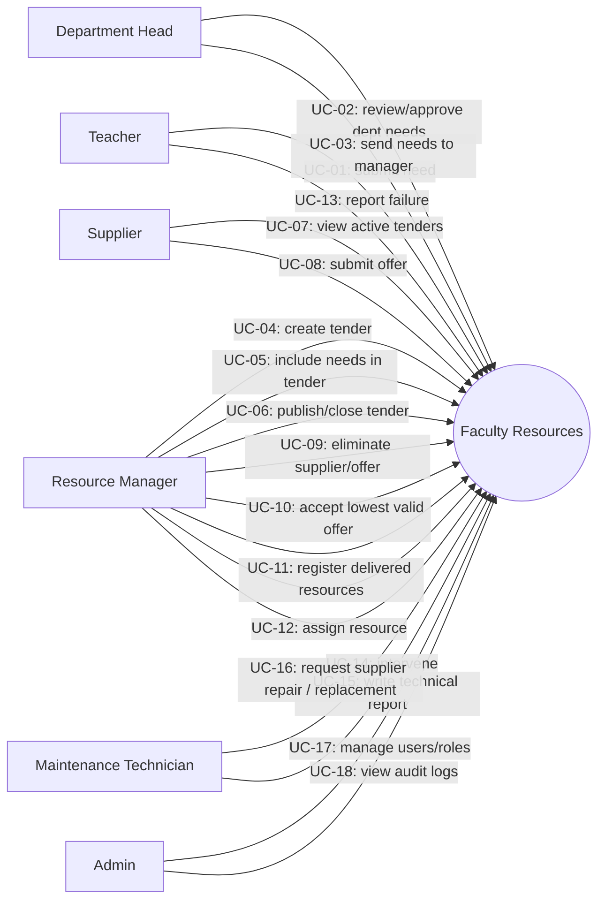

# Use cases

## Detailed use cases (illustrative)

### UC-08 — Supplier submits an offer

**Pre-conditions**: supplier authenticated, supplier not blacklisted, target tender is `PUBLISHED`
and within `[startDate, endDate]`.

**Main flow**:
1. Supplier opens the active tender and clicks *Submit offer*.
2. Supplier fills lines: resource type, brand, unit price, quantity, warranty months, future
   delivery date.
3. Front-end totals are advisory; the server recomputes the total.
4. Server creates the offer in `DRAFT`, then immediately calls `submit` to move it to `SUBMITTED`.
5. All resource managers are notified.
6. Audit `offer.create` and `offer.submit` are recorded.

**Alternate flows**:
- Tender out of window → `BUSINESS_RULE_VIOLATION` 422.
- Supplier blacklisted → `FORBIDDEN` 403.

### UC-10 — Resource manager accepts the lowest valid offer

**Pre-conditions**: tender in `EVALUATION` (or after `submit`), at least one valid offer exists.

**Main flow**:
1. Manager opens the evaluation page; offers are displayed in ascending total order.
2. Manager clicks *Accept* on the candidate.
3. The server verifies the candidate is the lowest valid offer (excluding eliminated and
   blacklisted-supplier offers). If a strictly lower valid offer exists, the API blocks the
   accept with `BUSINESS_RULE_VIOLATION`.
4. The accepted offer transitions to `ACCEPTED`, all other open offers transition to `REJECTED`,
   and the tender transitions to `AWARDED`.
5. The accepted supplier is notified (`OFFER_ACCEPTED`); rejected suppliers receive
   `OFFER_REJECTED`.

### UC-15 — Technician writes a technical report

**Pre-conditions**: failure is in `SEVERE` status.

**Main flow**:
1. Technician opens the severe failure and selects *Write technical report*.
2. Technician fills explanation, appearance date, frequency, and type.
3. Server validates printer-failure-hardware-only rule.
4. Failure transitions to `TECHNICAL_REPORT_CREATED`. Resource managers are notified.
