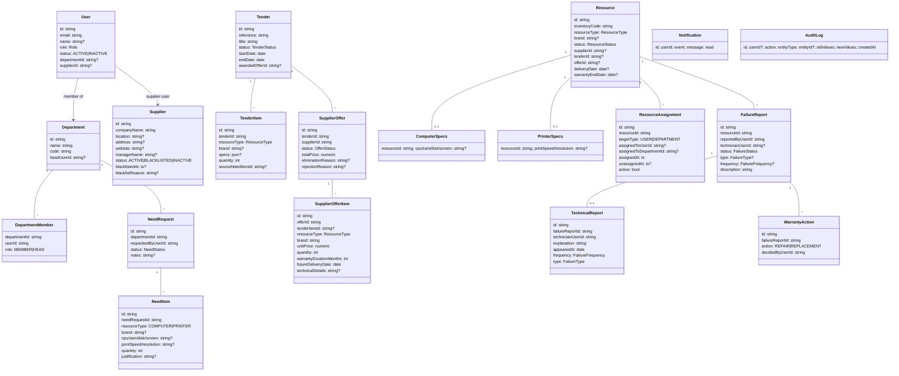

# UML — Class diagram

```mermaid
classDiagram
  class User {
    id: string
    email: string
    name: string?
    role: Role
    status: ACTIVE|INACTIVE
    departmentId: string?
    supplierId: string?
  }
  class Department {
    id: string
    name: string
    code: string
    headUserId: string?
  }
  class DepartmentMember {
    departmentId: string
    userId: string
    role: MEMBER|HEAD
  }
  class Supplier {
    id: string
    companyName: string
    location: string?
    address: string?
    website: string?
    managerName: string?
    status: ACTIVE|BLACKLISTED|INACTIVE
    blacklistedAt: ts?
    blacklistReason: string?
  }
  class NeedRequest {
    id: string
    departmentId: string
    requestedByUserId: string
    status: NeedStatus
    notes: string?
  }
  class NeedItem {
    id: string
    needRequestId: string
    resourceType: COMPUTER|PRINTER
    brand: string?
    cpu/ram/disk/screen: string?
    printSpeed/resolution: string?
    quantity: int
    justification: string?
  }
  class Tender {
    id: string
    reference: string
    title: string
    status: TenderStatus
    startDate: date
    endDate: date
    awardedOfferId: string?
  }
  class TenderItem {
    id: string
    tenderId: string
    resourceType: ResourceType
    brand: string?
    specs: json?
    quantity: int
    sourceNeedItemId: string?
  }
  class SupplierOffer {
    id: string
    tenderId: string
    supplierId: string
    status: OfferStatus
    totalPrice: numeric
    eliminationReason: string?
    rejectionReason: string?
  }
  class SupplierOfferItem {
    id: string
    offerId: string
    tenderItemId: string?
    resourceType: ResourceType
    brand: string
    unitPrice: numeric
    quantity: int
    warrantyDurationMonths: int
    futureDeliveryDate: date
    technicalDetails: string?
  }
  class Resource {
    id: string
    inventoryCode: string
    resourceType: ResourceType
    brand: string?
    status: ResourceStatus
    supplierId: string?
    tenderId: string?
    offerId: string?
    deliveryDate: date?
    warrantyEndDate: date?
  }
  class ComputerSpecs { resourceId: string; cpu/ram/disk/screen: string? }
  class PrinterSpecs { resourceId: string; printSpeed/resolution: string? }
  class ResourceAssignment {
    id: string
    resourceId: string
    targetType: USER|DEPARTMENT
    assignedToUserId: string?
    assignedToDepartmentId: string?
    assignedAt: ts
    unassignedAt: ts?
    active: bool
  }
  class FailureReport {
    id: string
    resourceId: string
    reportedByUserId: string
    technicianUserId: string?
    status: FailureStatus
    type: FailureType?
    frequency: FailureFrequency?
    description: string
  }
  class TechnicalReport {
    id: string
    failureReportId: string
    technicianUserId: string
    explanation: string
    appearedAt: date
    frequency: FailureFrequency
    type: FailureType
  }
  class WarrantyAction {
    id: string
    failureReportId: string
    action: REPAIR|REPLACEMENT
    decidedByUserId: string
  }
  class Notification { id; userId; event; message; read }
  class AuditLog { id; userId?; action; entityType; entityId?; oldValues; newValues; createdAt }

  User --> Department : member of
  User --> Supplier : supplier user
  Department "1" -- "*" DepartmentMember
  Department "1" -- "*" NeedRequest
  NeedRequest "1" -- "*" NeedItem
  Tender "1" -- "*" TenderItem
  Tender "1" -- "*" SupplierOffer
  SupplierOffer "1" -- "*" SupplierOfferItem
  Resource "1" -- "0..1" ComputerSpecs
  Resource "1" -- "0..1" PrinterSpecs
  Resource "1" -- "*" ResourceAssignment
  Resource "1" -- "*" FailureReport
  FailureReport "1" -- "0..1" TechnicalReport
  FailureReport "1" -- "*" WarrantyAction
```
