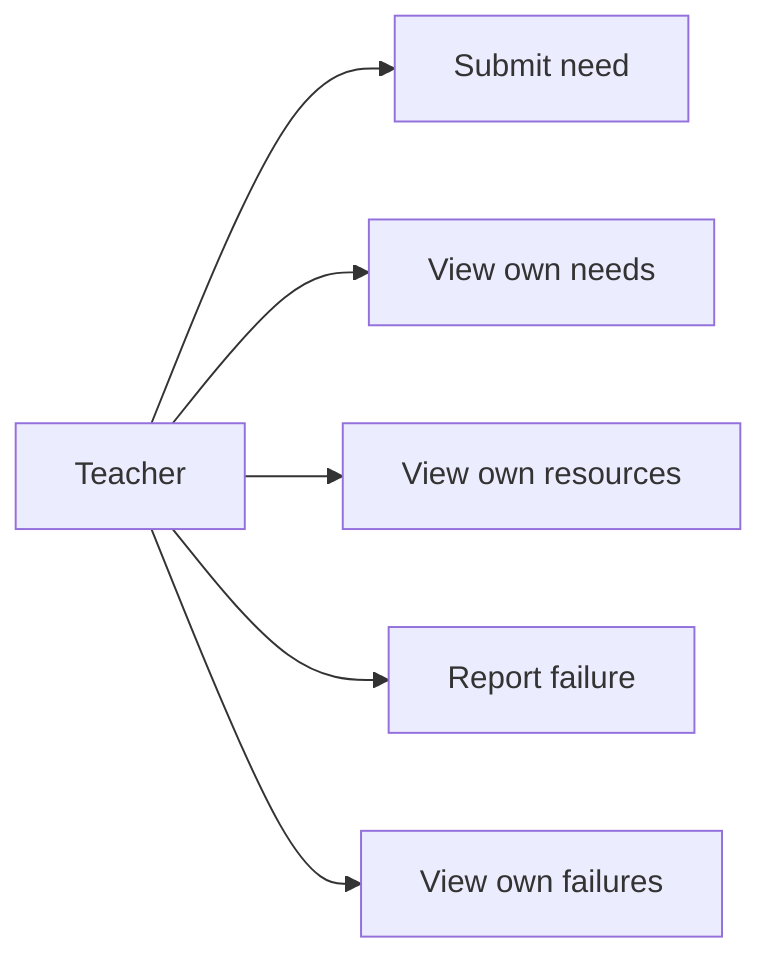
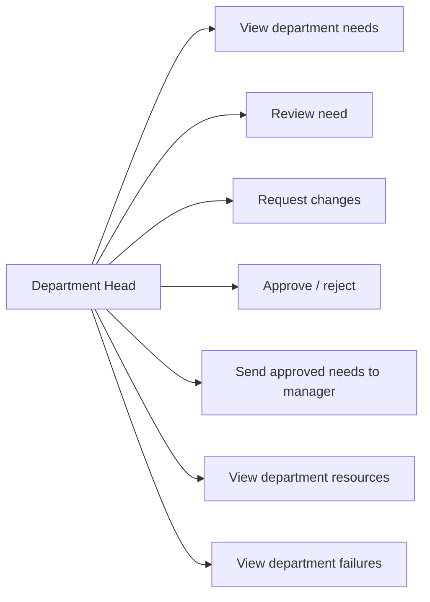
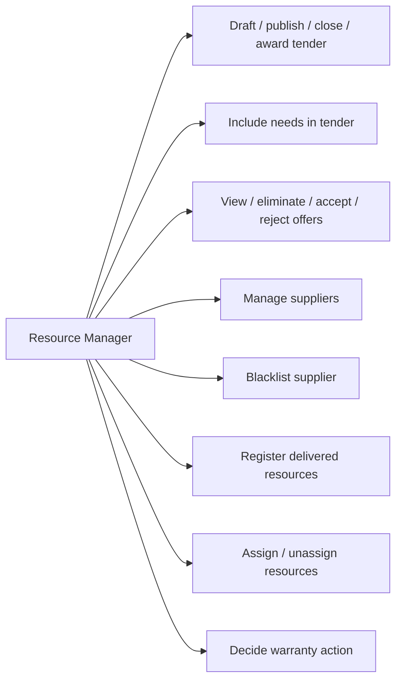
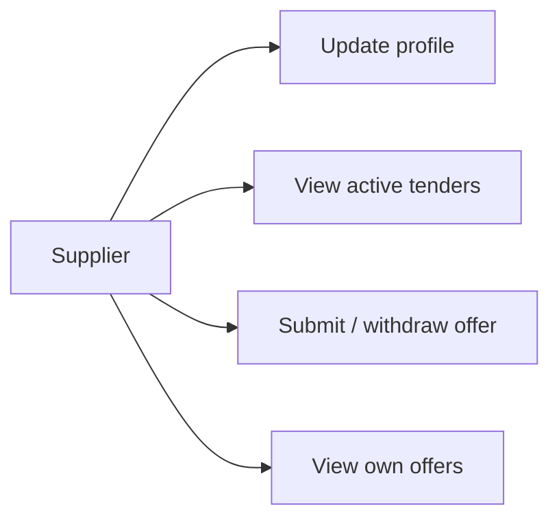
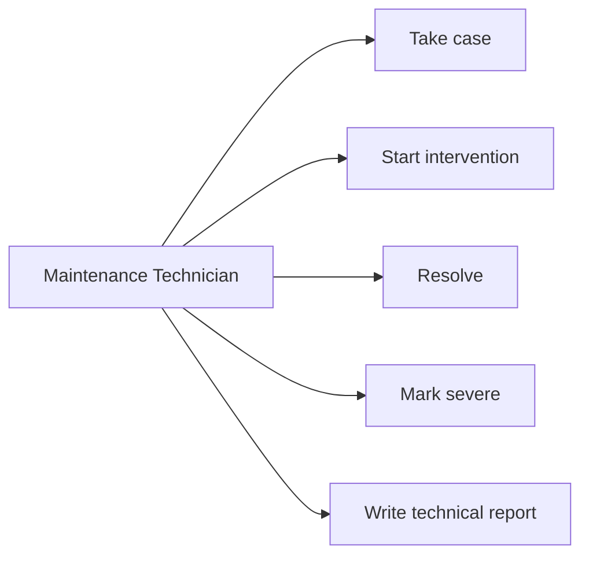
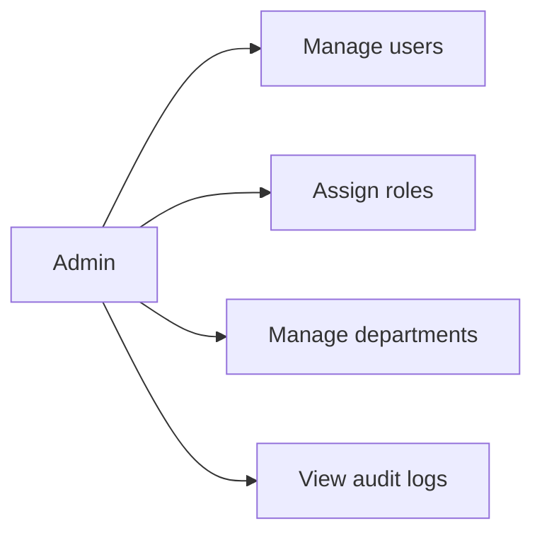

# UML — Use case diagrams

See `docs/requirements/use-cases.md` for the master list. Per-actor diagrams:

## Teacher

## Department head

## Resource manager

## Supplier

## Maintenance technician

## Admin

